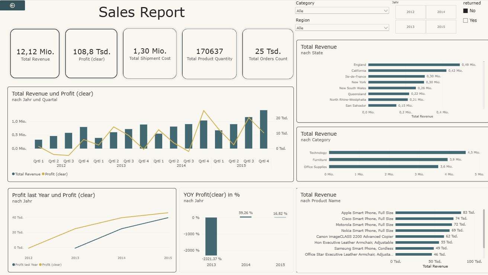
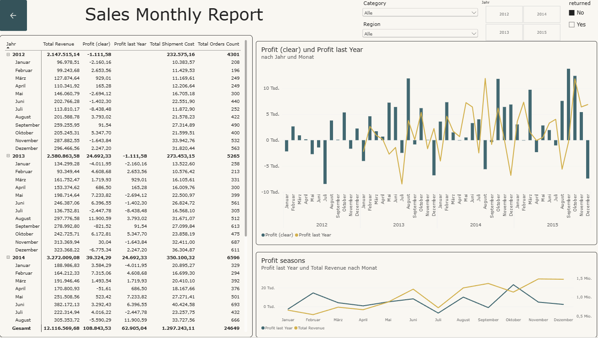
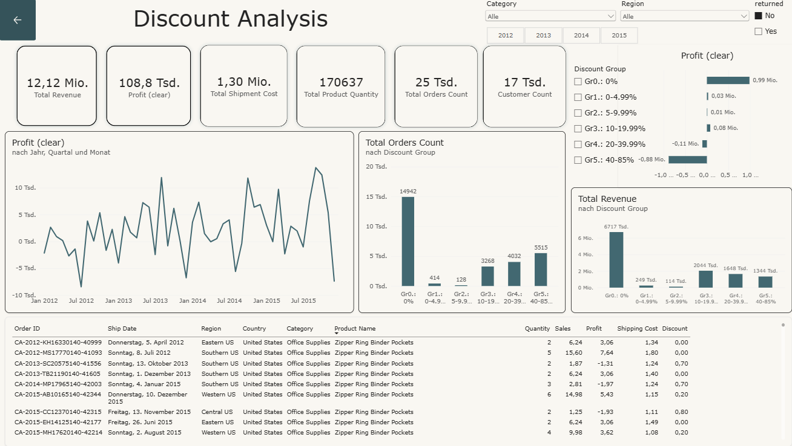
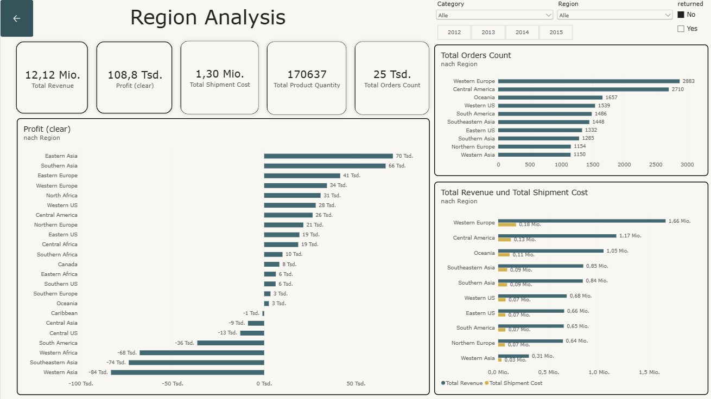
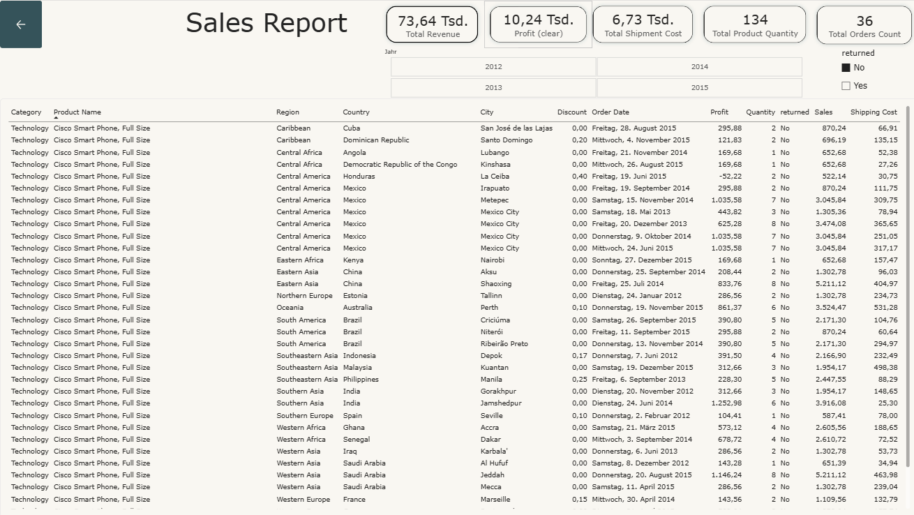

# Global Superstore Financial & Sales Analysis (Power BI)

##  Project Overview
This project presents an end-to-end data analysis and interactive Power BI report created for a large global distributor operating in the US and international markets. The primary business goal is to analyze historical performance, uncover key operational challenges, and identify strategic opportunities to enhance profitability.

The project covers data extraction, transformation, Star Schema data modeling, DAX measure creation, and the design of an interactive multi-page dashboard.

---

##  Dataset Description
The source dataset [view](superstore_dataset.xlsx) includes global sales transactions across multiple years and consists of the following relational entities:

* **Orders:** Historical transaction data including order dates, sales volume, shipping costs, discounts, and profit margins.
* **Location/Cities:** Detailed destination geography for shipped products.
* **Products:** Product catalog details including sub-categories and overarching categories.
* **Customers:** Demographic and identification details of corporate, consumer, and home office clients.
* **Returns:** Log of returned items and order cancellations.
* **Sales Representatives:** Region-to-manager mappings.

---

## Data Transformation & Modeling (ETL)

### Data Cleaning & Power Query Steps
1. **Header & Table Renaming:** Renamed source tables to clear, standardized business terms and ensured top-row headers were correctly assigned.
2. **Handling Missing Values:** Replaced `null` values with meaningful defaults (e.g., `'no code'`, `'non US'`).
3. **Surrogate Keys:** Created a unique composite address key (`Postal Code + City`) across location tables to ensure clean relationship mapping.
4. **Calendar Table (`DimDate`):** Built a dedicated Date Dimension table to enable time-intelligence calculations.

---

## Key DAX Measures

The analytical logic includes custom DAX measures for core KPIs and Time Intelligence analysis:

* **Total Sales**  
* **Total Profit**  
* **Total Shipping Cost**  
* **Net Profit (incl. Shipping)**  
* **Profit Margin (%)**  
* **Year-over-Year (YoY) Net Profit**  

---

## Dashboard Structure

The Power BI Desktop report (`.pbix`) consists of the following structured report pages:

### 1.  Financial Overview
* **KPI Summary Cards:** Quick view of Total Sales, Total Profit, Net Profit, and Profit Margin.
* **Time Series Chart:** Visualizing sales and profit trends across years and quarters.
* **Top Performers & Distributions:** Top 10 products by revenue, breakdown by region, and category share.
* **Slicers:** Year, Region, and Product Category filters.

### 2. Monthly Metrics & YoY Analysis
* **Monthly Matrix/Table View:** Granular view of Sales, Shipping Costs, and Profit on a monthly level.
* **YoY Performance Tracking:** Visual indicators highlighting period-over-period variance against previous years.
* **Slicers:** Multi-attribute filtering for deep-dive temporal analysis.

### 3. Discount Impact Analysis
* **Discount Level Breakdown:** Evaluates order volumes, total revenue, and net profit across different discount brackets.
* **Profitability Thresholds:** Pinpoints discount rates where margins erode or become negative.
* **Interactive Slicers:** Filtering by customer segment and shipping modes.

### 4. Attribute Deep Dive (Shipping & Regional Drivers)
* **Exploratory Analysis:** Deep-dive analysis on shipping in different regions and regional impact on overall profitability.

### 5. Detailed Orders List (Drill-Through Page)
* **Hidden Target Page:** Designed specifically for targeted drill-throughs from summary pages rather than broad viewing.
* **Granular View:** Displays line-item order details filtered dynamically by selected attributes (e.g., viewing all orders within a specific discount tier or shipping mode).

---

##  Key Analytical Insights

### Discount Policy Analysis
* **Zero-Discount Profitability:** Orders with 0% discount generated **$0.99M** in net profit across **$6.72M** in revenue.
* **Margin Erosion:** Deep discount brackets (40%–85%) resulted in a net loss of **-$0.88M** across 5,515 orders.
* **Recommendation:** Cap max promotional discounts at 20% to prevent margin destruction on high-volume products.

### Regional Profitability Drivers
* **Top Profit Regions:** Eastern Asia ($70K), Southern Asia ($66K), and Eastern Europe ($41K).
* **Highest Volume & Revenue:** Western Europe ($1.66M Revenue / 2,883 Orders).
* **Loss-Making Territories:** Western Asia (-$84K), Southeastern Asia (-$74K), and Western Africa (-$68K).

### Financial Trajectory & Seasonality
* **Turnaround Growth:** Profit recovered from -$1.11K in 2012 to +$39.32K in 2014 (+59.26% YoY) and +$44.95K in 2015.
* **Category Mix:** Technology leads total sales ($4.5M), followed by Furniture ($3.9M) and Office Supplies ($3.6M).
* **Seasonality Pattern:** Sales and order volumes peak consistently in Q4 (September–December).